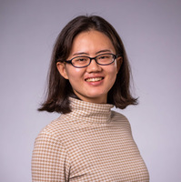

Welcome to the homepage for COS 316, Principles of Computer System
Design, Fall 2023.

### Quick Links

**Time** [Lectures](lectures) are Tuesday and Thursday, 10:00am-10:50am, [Precepts](precepts) are on Thursdays and Fridays.

**Location** [Computer Science Building](https://api.princeton.edu/campus-map/link?id=0167), Room 104

**Description.** This course teaches students the design,
implementation, and evaluation of computer systems, including operating
systems, networking, and distributed systems.The course will teach
students to evaluate the performance and study the design choices of
existing systems. Students will also learn general systems concepts that
support design goals of modularity, performance, and security. Students
will apply materials learned in lectures and readings to design, build
and evaluate new systems components.

**Textbook.** There is no required textbook in this course, because
there is no one book that covers the right material in an up-to-date
fashion. Some required articles/papers/blogs/etc. will be posted
on-line.

**Grading.** Coming soon... <!--Programming assigments 60%, Problem Sets 20%, Final Project 20%.-->

## Course Staff

You may contact course staff via the Ed discussion board. Office hours are in
Princeton (Eastern) time.

{:.staff}
* \
Prof. Amit Levy\
Office Hours:
Tue. 11am-12pm\
COS 307

* \
Prof. Ravi Netravali\
Office Hours:
Thu. 11am-12pm\
COS 322

{:.staff}

* \
Christopher Branner-Augmon\
Office Hours:
Tue. 2:00pm-3:00pm

* \
Leo Chen\
Office Hours:
Thu. 3:00pm-4:00pm

* \
Mike Wong\
Office Hours:
Wed. 10:00am-11:00am

* \
Rui Pan\
Office Hours:
Fri. 12:30am-1:30pm

* \
Yinwei Dai\
Office Hours:
Mon. 4:30pm-5:30pm

* \
Leon Schuermann\
Office Hours:
Thu. 2:00pm-3:00pm\
CS 003

* \
Yue Tan\
Office Hours:
Tue. 4:00pm-5:00pm

